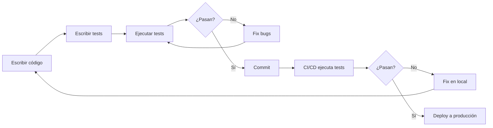

# Testing

> **Garantizar calidad del código con tests automatizados**

---

## ¿Por qué testing?

En un proyecto FullStack (React + Django + PostgreSQL), los **tests automatizados** son esenciales:

- ✅ **Detectar bugs antes de producción**
- ✅ **Refactorizar con confianza**
- ✅ **Documentación viva del código**
- ✅ **Facilitar colaboración en equipo**
- ✅ **Acelerar desarrollo a largo plazo**

---

## Estrategia de testing

### Pirámide de testing

```
       /\
      /  \  E2E (10%)
     /____\
    /      \  Integration (20%)
   /________\
  /          \ Unit (70%)
 /____________\
```

**Unit Tests (70%):**
- Funciones individuales
- Componentes aislados
- Lógica de negocio
- **Rápidos** (milisegundos)

**Integration Tests (20%):**
- Frontend + Backend
- API endpoints
- Base de datos
- **Moderados** (segundos)

**E2E Tests (10%):**
- Flujos completos de usuario
- Navegador real
- **Lentos** (minutos)

---

## Stack de testing

### Frontend (React)

**[Vitest](https://vitest.dev/)** → Tests unitarios
```bash
npm install -D vitest @testing-library/react @testing-library/user-event jsdom
```

**[React Testing Library](https://testing-library.com/react)** → Componentes
```javascript
import { render, screen } from '@testing-library/react';
import { expect, test } from 'vitest';

test('renderiza botón', () => {
    render(<Button>Click me</Button>);
    expect(screen.getByText('Click me')).toBeInTheDocument();
});
```

---

### Backend (Django)

**[pytest](https://pytest.org/)** → Tests unitarios + API
```bash
pip install pytest pytest-django pytest-cov
```

**[Factory Boy](https://factoryboy.readthedocs.io/)** → Datos de prueba
```python
import pytest
from productos.models import Producto

def test_crear_producto(db):
    producto = Producto.objects.create(
        nombre="Laptop",
        precio=1500,
        stock=10
    )
    assert producto.nombre == "Laptop"
```

---

### E2E (End-to-End)

**[Playwright](https://playwright.dev/)** → Tests de usuario real
```bash
npm create playwright@latest
```

```javascript
import { test, expect } from '@playwright/test';

test('usuario puede hacer login', async ({ page }) => {
    await page.goto('/login');
    await page.fill('input[name="username"]', 'testuser');
    await page.fill('input[name="password"]', 'password123');
    await page.click('button[type="submit"]');
    
    await expect(page).toHaveURL('/');
});
```

---

## Contenido del módulo

### 01 - Introducción al Testing
- **Conceptos:** Unit, Integration, E2E
- **Test Pyramid:** 70% Unit, 20% Integration, 10% E2E
- **TDD:** Red → Green → Refactor
- **Coverage:** Medir cobertura de código
- **Mocking:** Simular dependencias externas

**Tiempo estimado:** 1 hora

---

### 02 - Testing Frontend (Vitest + React Testing Library)
- **Setup:** Vitest configuration
- **Component testing:** render, screen, queries
- **User interactions:** userEvent.click(), userEvent.type()
- **Async testing:** waitFor, findBy
- **Mocking APIs:** vi.mock()
- **Testing hooks:** renderHook
- **Context testing:** Wrap con AuthProvider
- **Coverage:** vitest --coverage

**Tiempo estimado:** 3 horas

---

### 03 - Testing Backend (Pytest + Django)
- **Setup:** pytest-django configuration
- **Fixtures:** user, api_client, authenticated_client
- **Model testing:** Validaciones, métodos
- **Serializer testing:** Serialize, deserialize
- **API testing:** GET, POST, PUT, DELETE
- **Authentication testing:** Register, login, tokens
- **Factory Boy:** UserFactory, ProductoFactory
- **Parametrized tests:** @pytest.mark.parametrize
- **Coverage:** pytest --cov

**Tiempo estimado:** 3 horas

---

### 04 - E2E con Playwright
- **Setup:** Playwright installation
- **Basic tests:** Navigation, assertions
- **Authentication flow:** Login, register, logout
- **CRUD testing:** Create, read, update, delete
- **File uploads:** Test image uploads
- **Page Object Model:** Organize tests
- **API mocking:** Intercept requests
- **Screenshots/videos:** Debugging
- **CI/CD:** GitHub Actions

**Tiempo estimado:** 3 horas

---

## Flujo de testing en desarrollo



---

## Comandos rápidos

### Frontend
```bash
# Tests unitarios
npm run test

# Watch mode
npm run test -- --watch

# Coverage
npm run test -- --coverage

# UI mode
npm run test -- --ui
```

### Backend
```bash
# Todos los tests
pytest

# Test específico
pytest tests/test_productos.py

# Coverage
pytest --cov=productos --cov-report=html

# Verbose
pytest -v
```

### E2E
```bash
# Ejecutar todos los tests E2E
npx playwright test

# Modo interactivo
npx playwright test --ui

# Debug mode
npx playwright test --debug

# Solo Chrome
npx playwright test --project=chromium

# Ver reporte
npx playwright show-report
```

---

## Cuándo ejecutar tests

✅ **Antes de cada commit**
```bash
# Frontend
npm run test

# Backend
pytest

# Todo junto
npm run test && pytest
```

✅ **Antes de cada PR**
```bash
# Frontend con coverage
npm run test -- --coverage

# Backend con coverage
pytest --cov

# E2E críticos
npx playwright test e2e/auth.spec.js
```

✅ **En CI/CD (automático)**
- Cada push a GitHub
- GitHub Actions ejecuta:
  - npm run test
  - pytest
  - npx playwright test
- Si falla, bloquea merge

---

## Objetivos de coverage

| Tipo | Coverage mínimo | Ideal |
|------|----------------|-------|
| **Unit Tests** | 70% | 85%+ |
| **Integration** | 50% | 70%+ |
| **E2E** | Críticos | Críticos + Principales |

**Priorizar:**
1. **Lógica de negocio** (cálculos, validaciones)
2. **Autenticación/autorización** (seguridad)
3. **CRUD principal** (productos, usuarios)
4. **Edge cases** (errores, límites)

**No priorizar:**
- UI pura (estilos)
- Third-party libraries
- Generated code

---

## Ejemplo: Test de feature completa

### 1. Backend (pytest)
```python
# tests/test_productos.py
def test_crear_producto_autenticado(authenticated_client, db):
    response = authenticated_client.post('/api/productos/', {
        'nombre': 'Laptop',
        'precio': 1500,
        'stock': 10
    })
    assert response.status_code == 201
    assert response.data['nombre'] == 'Laptop'
```

### 2. Frontend (Vitest)
```javascript
// src/components/ProductoForm.test.jsx
test('envía formulario correctamente', async () => {
    render(<ProductoForm />);
    
    await userEvent.type(screen.getByLabelText('Nombre'), 'Laptop');
    await userEvent.type(screen.getByLabelText('Precio'), '1500');
    await userEvent.click(screen.getByText('Crear'));
    
    await waitFor(() => {
        expect(screen.getByText('Producto creado')).toBeInTheDocument();
    });
});
```

### 3. E2E (Playwright)
```javascript
// e2e/productos.spec.js
test('crear producto completo', async ({ page }) => {
    await page.goto('/login');
    await page.fill('input[name="username"]', 'testuser');
    await page.fill('input[name="password"]', 'password123');
    await page.click('button:has-text("Entrar")');
    
    await page.goto('/productos/crear');
    await page.fill('input[name="nombre"]', 'Laptop');
    await page.fill('input[name="precio"]', '1500');
    await page.click('button[type="submit"]');
    
    await expect(page.locator('text=Laptop')).toBeVisible();
});
```

---

## Mejores prácticas

✅ **Tests independientes**
- Cada test debe poder ejecutarse solo
- No depender del orden de ejecución

✅ **AAA Pattern**
```javascript
test('ejemplo', () => {
    // Arrange (preparar)
    const data = { nombre: 'Test' };
    
    // Act (actuar)
    const result = procesarData(data);
    
    // Assert (verificar)
    expect(result).toBe('Test procesado');
});
```

✅ **Nombres descriptivos**
```javascript
// ❌ Mal
test('test1', () => { ... });

// ✅ Bien
test('usuario autenticado puede crear producto', () => { ... });
```

✅ **Un concepto por test**
```javascript
// ❌ Mal
test('productos', () => {
    // Testea crear, editar, eliminar en un solo test
});

// ✅ Bien
test('crear producto', () => { ... });
test('editar producto', () => { ... });
test('eliminar producto', () => { ... });
```

✅ **Limpiar después de cada test**
```javascript
afterEach(() => {
    // Limpiar datos de prueba
    cleanup();
});
```

---

## Estructura de archivos

```
proyecto/
├── frontend/
│   ├── src/
│   │   ├── components/
│   │   │   ├── Button.jsx
│   │   │   └── Button.test.jsx          ← Test al lado del componente
│   │   ├── services/
│   │   │   ├── productoService.js
│   │   │   └── productoService.test.js
│   │   └── hooks/
│   │       ├── useProductos.js
│   │       └── useProductos.test.js
│   ├── e2e/
│   │   ├── auth.spec.js
│   │   ├── productos.spec.js
│   │   └── pages/
│   │       ├── LoginPage.js
│   │       └── ProductosPage.js
│   ├── vitest.config.js
│   └── playwright.config.js
│
├── backend/
│   ├── productos/
│   │   ├── models.py
│   │   ├── serializers.py
│   │   ├── views.py
│   │   └── tests/
│   │       ├── test_models.py
│   │       ├── test_serializers.py
│   │       └── test_views.py
│   ├── usuarios/
│   │   └── tests/
│   │       └── test_auth.py
│   ├── pytest.ini
│   └── conftest.py
│
└── .github/
    └── workflows/
        └── tests.yml                     ← CI/CD
```

---

## Debugging tests

### Frontend (Vitest)
```bash
# Debug en VSCode
# Agregar breakpoint y ejecutar en debug mode

# Debug en navegador
npm run test -- --ui
```

### Backend (pytest)
```bash
# Print statements
pytest -s

# Debugger
pytest --pdb

# Verbose
pytest -vv
```

### E2E (Playwright)
```bash
# Modo debug (paso a paso)
npx playwright test --debug

# Headed mode (ver navegador)
npx playwright test --headed

# Trace viewer (después del test)
npx playwright show-trace trace.zip
```

---

## CI/CD Integration

```yaml
# .github/workflows/tests.yml
name: Tests
on: [push, pull_request]
jobs:
  test:
    runs-on: ubuntu-latest
    steps:
      - uses: actions/checkout@v3
      
      # Frontend tests
      - name: Setup Node
        uses: actions/setup-node@v3
        with:
          node-version: 18
      
      - name: Install frontend dependencies
        run: cd frontend && npm ci
      
      - name: Run frontend tests
        run: cd frontend && npm run test -- --coverage
      
      # Backend tests
      - name: Setup Python
        uses: actions/setup-python@v4
        with:
          python-version: 3.11
      
      - name: Install backend dependencies
        run: cd backend && pip install -r requirements.txt
      
      - name: Run backend tests
        run: cd backend && pytest --cov
      
      # E2E tests
      - name: Install Playwright
        run: cd frontend && npx playwright install --with-deps
      
      - name: Run E2E tests
        run: cd frontend && npx playwright test
      
      - name: Upload coverage
        uses: codecov/codecov-action@v3
```

---

## Recursos

### Documentación
- **[Vitest](https://vitest.dev/)** - Tests unitarios frontend
- **[React Testing Library](https://testing-library.com/react)** - Testing de componentes
- **[pytest](https://pytest.org/)** - Tests backend
- **[pytest-django](https://pytest-django.readthedocs.io/)** - Django testing
- **[Playwright](https://playwright.dev/)** - E2E testing

### Cursos
- **[Testing JavaScript](https://testingjavascript.com/)** - Kent C. Dodds
- **[Test-Driven Development with Python](https://www.obeythetestinggoat.com/)** - Harry Percival

### Libros
- **"Test-Driven Development by Example"** - Kent Beck
- **"Working Effectively with Legacy Code"** - Michael Feathers

---

## Próximo módulo: 07-arquitectura

En el próximo módulo aprenderemos:
- Clean Architecture
- SOLID Principles
- Design Patterns
- Repository Pattern
- Organización de código escalable

¡Testing completo! 🧪✅
